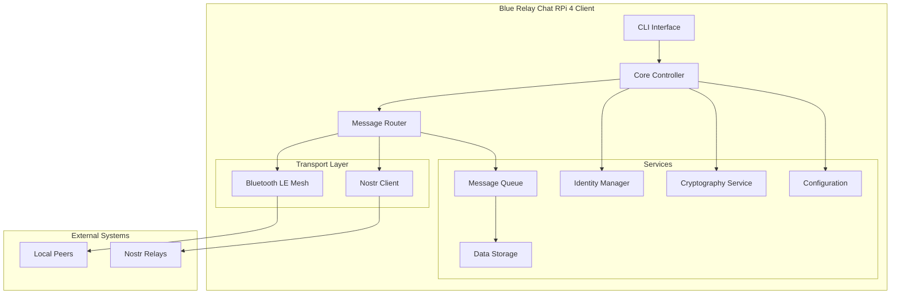
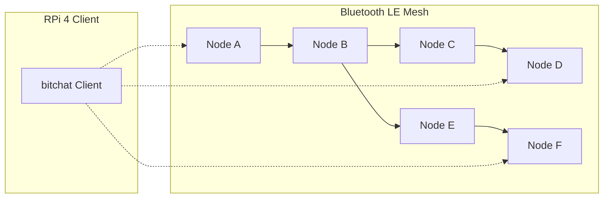
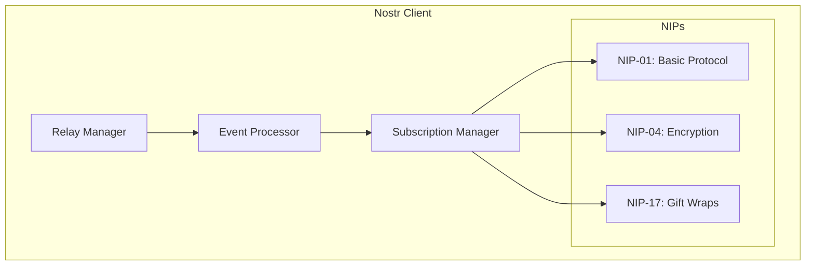
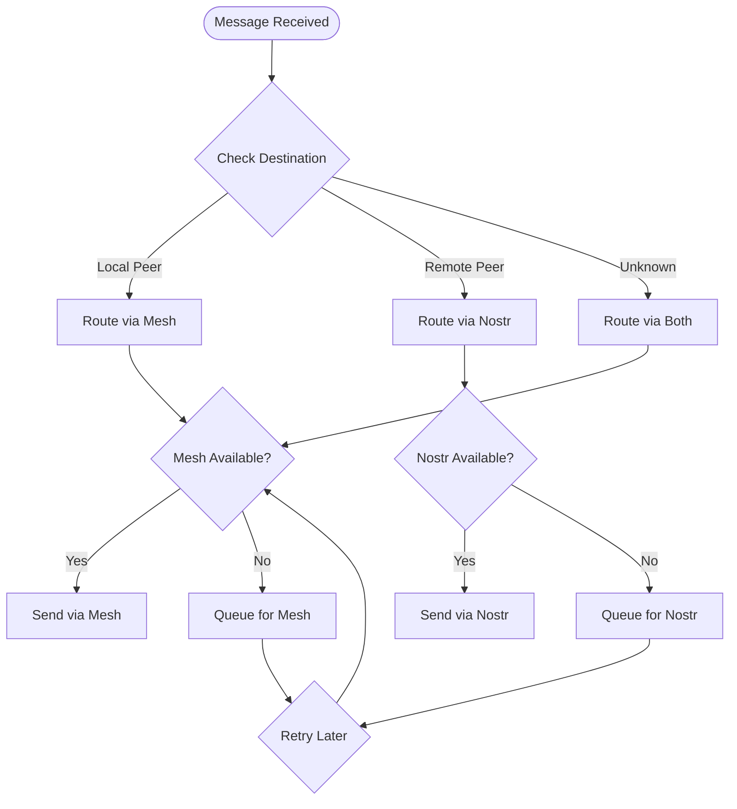
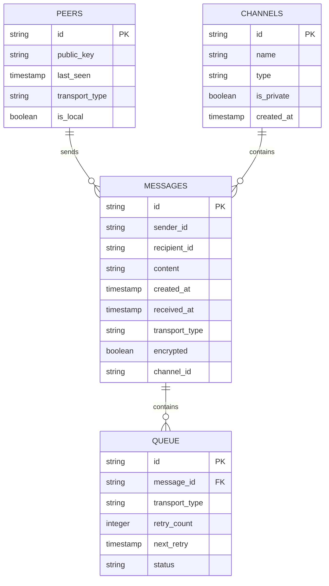

# Blue Relay Chat RPi 4 - Architecture Design

## 1. Executive Summary

This document outlines the architecture for the Raspberry Pi 4 implementation of **Blue Relay Chat (BRC)**, a decentralized messaging application that utilizes a dual-transport approach combining Bluetooth LE Mesh and the Nostr protocol. The implementation will be in Python 3, designed to run efficiently on RPi 4 hardware with both headless and interactive CLI modes.

## 2. System Overview

### 2.1 Core Architecture Principles

1. **Dual-Transport Design**: Seamless integration between local Bluetooth LE Mesh and global Nostr protocol
2. **Modularity**: Clean separation of concerns with well-defined interfaces
3. **Resource Efficiency**: Optimized for low-power RPi 4 hardware
4. **Security First**: End-to-end encryption for private messages
5. **Resilience**: Robust error handling and automatic recovery

### 2.2 High-Level Architecture



## 3. Module Architecture

### 3.1 Core Modules

#### 3.1.1 Main Application Controller (`main.py`)
- Application entry point and lifecycle management
- Service initialization and coordination
- Signal handling for graceful shutdown

#### 3.1.2 CLI Interface (`cli/`)
- Interactive command-line interface using `curses`
- Command parsing and execution
- Real-time message display and status updates

#### 3.1.3 Message Router (`router/`)
- Central message routing logic
- Transport selection and failover
- Message prioritization and queuing

#### 3.1.4 Transport Layer (`transports/`)
- Abstract transport interface
- Bluetooth LE Mesh implementation
- Nostr protocol implementation

#### 3.1.5 Security Services (`security/`)
- Identity management (key generation/storage)
- Encryption/decryption services
- Noise Protocol implementation for mesh
- NIP-17 implementation for Nostr

#### 3.1.6 Data Management (`data/`)
- SQLite database for persistent storage
- Configuration management
- Message persistence and retrieval

### 3.2 Supporting Modules

#### 3.2.1 Utilities (`utils/`)
- Logging facilities
- Geohash utilities
- Compression/decompression (LZ4)
- Common helper functions

#### 3.2.2 Configuration (`config/`)
- Configuration file parsing
- Environment variable handling
- Default settings management

## 4. Transport Layer Design

### 4.1 Bluetooth LE Mesh Implementation

#### 4.1.1 Technology Stack
- **BlueZ**: Linux Bluetooth protocol stack
- **bleak**: Python async BLE library
- **Custom Mesh Protocol**: Lightweight binary protocol for multi-hop routing

#### 4.1.2 Mesh Architecture


#### 4.1.3 Mesh Protocol Design
- **Packet Format**: Binary format using `struct` for efficiency
- **Routing Algorithm**: Distance-vector with TTL (Time To Live)
- **Discovery**: Continuous advertising and scanning
- **Relay Logic**: Store-and-forward with deduplication

### 4.2 Nostr Protocol Implementation

#### 4.2.1 Technology Stack
- **WebSockets**: Real-time communication with relays
- **NIPs Implementation**: Key Nostr Improvement Proposals
- **Async I/O**: Non-blocking relay communication

#### 4.2.2 Nostr Client Architecture


## 5. Message Flow Architecture

### 5.1 Message Routing Logic



### 5.2 Queuing System

- **Priority Queue**: Prioritize messages by type and age
- **Persistence**: SQLite-based queue storage
- **Retry Logic**: Exponential backoff for failed deliveries
- **Deduplication**: Prevent duplicate message transmission

## 6. Security Architecture

### 6.1 Identity Management

- **Ephemeral Keys**: Generated on first run
- **Key Storage**: Encrypted local storage
- **Key Recovery**: Optional seed phrase for backup

### 6.2 Encryption Strategy

#### 6.2.1 Mesh Encryption (Noise Protocol)
- **Handshake**: XX pattern for mutual authentication
- **Cipher**: ChaCha20-Poly1305
- **Key Rotation**: Per-session keys with forward secrecy

#### 6.2.2 Nostr Encryption (NIP-17)
- **Gift Wraps**: Encrypted container format
- **Seals**: Additional encryption layer
- **Rumors**: Content encrypted to specific recipients

### 6.3 Emergency Wipe

- **Secure Deletion**: Cryptographic wiping of keys and data
- **GPIO Trigger**: Hardware trigger for emergency situations
- **Multi-Confirmation**: Require multiple confirmations

## 7. Data Management

### 7.1 Database Schema



### 7.2 Configuration Management

- **File Format**: INI-style configuration file
- **Environment Variables**: Override for deployment
- **Runtime Updates**: Hot-reload for certain settings

## 8. CLI Interface Design

### 8.1 Interface Layout

```
┌─ bitchat RPi 4 ─────────────────────────────────────┐
│ Status: Connected (Mesh: 3 peers, Nostr: Online)    │
│ Channel: #bluetooth [Mesh]                          │
├─────────────────────────────────────────────────────┤
│ [12:34] User1: This is a message                    │
│ [12:35] User2: This is another message              │
│ [12:36] System: User3 joined the mesh               │
│                                                     │
│                                                     │
├─────────────────────────────────────────────────────┤
│ > /msg User4 Hello there                            │
└─────────────────────────────────────────────────────┘
```

### 8.2 Command Set

- **Basic Commands**: `/join`, `/leave`, `/msg`, `/who`
- **Channel Commands**: `/list`, `/create`, `/invite`
- **System Commands**: `/status`, `/config`, `/wipe`
- **Navigation**: Arrow keys, Page Up/Down, Tab completion

## 9. Deployment Architecture

### 9.1 Service Management

- **systemd Service**: Background operation on boot
- **User Service**: Per-user instances
- **Resource Limits**: CPU and memory constraints

### 9.2 Installation Strategy

- **Package Management**: pip with requirements.txt
- **System Dependencies**: BlueZ, SQLite, system libraries
- **Configuration**: Default config with user overrides

## 10. Testing Strategy

### 10.1 Unit Testing

- **Core Logic**: Message routing, encryption, parsing
- **Transport Modules**: Mocked Bluetooth and Nostr
- **Data Layer**: Database operations and validation

### 10.2 Integration Testing

- **Transport Integration**: Real Bluetooth and Nostr connections
- **End-to-End**: Message delivery across transports
- **Performance**: Resource usage and latency

### 10.3 Test Environment

- **Hardware Emulation**: QEMU for CI/CD
- **Docker Containers**: Isolated test environments
- **Mock Networks**: Simulated mesh and relay conditions

## 11. Performance Considerations

### 11.1 Resource Optimization

- **Async I/O**: Non-blocking operations throughout
- **Memory Management**: Efficient data structures and pooling
- **CPU Usage**: Adaptive scanning and processing intervals

### 11.2 Network Optimization

- **Compression**: LZ4 compression for all messages

## 12. Hardware Compatibility

### 12.1 Raspberry Pi 4
- **CPU**: Broadcom BCM2711, Quad-core Cortex-A72 (ARMv8) 1.5GHz
- **RAM**: 1GB, 2GB, 4GB or 8GB LPDDR4-3200 SDRAM
- **Connectivity**: 2.4GHz and 5GHz IEEE 802.11ac wireless, Bluetooth 5.0, BLE
- **GPIO**: 40-pin GPIO header
- **Storage**: MicroSD card slot

### 12.2 Orange Pi Zero 2W
- **CPU**: Allwinner H618, Quad-core ARM Cortex-A53 @ 1.5GHz
- **RAM**: 512MB or 1GB LPDDR4
- **Connectivity**: 2.4GHz and 5GHz WiFi, Bluetooth 5.0, BLE
- **GPIO**: 26-pin GPIO header
- **Storage**: eMMC module (up to 64GB) + microSD card slot

### 12.3 Performance Considerations
The implementation includes hardware-specific optimizations:
- **Memory Management**: Adjusted queue sizes and connection limits for Orange Pi's lower RAM
- **GPIO Configuration**: Different pin mappings for emergency wipe functionality
- **Bluetooth Stack**: Configuration adjustments for different Bluetooth controllers
- **Power Management**: Optimized settings for each hardware platform
- **Batching**: Group operations where possible
- **Caching**: Peer information and routing tables

## 12. Security Considerations

### 12.1 Threat Model

- **Eavesdropping**: Prevented by end-to-end encryption
- **Message Tampering**: Detected by cryptographic signatures
- **Identity Spoofing**: Prevented by key-based authentication
- **Denial of Service**: Mitigated by rate limiting and validation

### 12.2 Security Best Practices

- **Key Management**: Secure generation, storage, and rotation
- **Input Validation**: Comprehensive validation of all inputs
- **Error Handling**: No information leakage in error messages
- **Audit Logging**: Security-relevant events logged

## 13. Future Extensibility

### 13.1 Plugin Architecture

- **Transport Plugins**: Support for additional transports
- **Filter Plugins**: Message filtering and processing
- **UI Plugins**: Alternative interface implementations

### 13.2 Protocol Evolution

- **Version Compatibility**: Backward-compatible protocol updates
- **Feature Negotiation**: Dynamic capability discovery
- **Migration Paths**: Smooth upgrade procedures

## 14. Implementation Roadmap

### Phase 1: Core Infrastructure
1. Basic project structure and configuration
2. Identity management and cryptography
3. Basic CLI interface
4. Message routing framework

### Phase 2: Transport Implementation
1. Bluetooth LE Mesh implementation
2. Nostr client implementation
3. Message queuing and persistence
4. Transport failover logic

### Phase 3: Features and Polish
1. Channel management
2. Location-based channels
3. Emergency wipe functionality
4. Performance optimization

### Phase 4: Testing and Deployment
1. Comprehensive test suite
2. Documentation and guides
3. Deployment automation
4. Performance benchmarking

## 15. Conclusion

This architecture provides a solid foundation for implementing the bitchat RPi 4 client according to the PRD requirements. The modular design ensures maintainability while the dual-transport approach provides resilience and flexibility. The focus on resource efficiency and security makes it suitable for the target deployment scenarios.