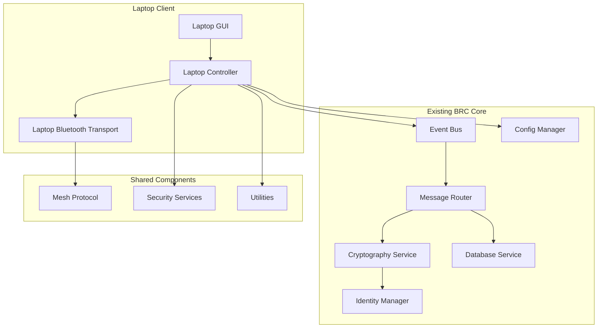

# BRC Core Components Integration Plan

## Overview

This document outlines how to integrate the laptop client with existing Blue Relay Chat (BRC) core components while maintaining compatibility and leveraging existing functionality.

## Integration Architecture

### Component Interaction Diagram



## Integration Strategy

### 1. Event System Integration

#### Event Bus Extension
```python
# bitchat/core/events.py - Add laptop-specific events

class EventTypes(Enum):
    # Existing events...
    MESSAGE_RECEIVED = "message_received"
    MESSAGE_SENT = "message_sent"
    PEER_CONNECTED = "peer_connected"
    PEER_DISCONNECTED = "peer_disconnected"
    TRANSPORT_CONNECTED = "transport_connected"
    TRANSPORT_DISCONNECTED = "transport_disconnected"
    
    # New laptop-specific events
    LAPTOP_GUI_READY = "laptop_gui_ready"
    LAPTOP_BLUETOOTH_DISCOVERED = "laptop_bluetooth_discovered"
    LAPTOP_CONNECTION_REQUESTED = "laptop_connection_requested"
    LAPTOP_CHANNEL_CHANGED = "laptop_channel_changed"
    LAPTOP_SETTINGS_UPDATED = "laptop_settings_updated"
```

#### Laptop Event Handlers
```python
# bitchat/core/laptop_controller.py - Event handling integration

class LaptopController:
    """Enhanced controller with full BRC integration."""
    
    def __init__(self, config_manager: ConfigManager, event_bus: EventBus):
        self.config = config_manager
        self.event_bus = event_bus
        self.logger = get_logger("laptop_controller")
        
        # Core components
        self.message_router: Optional[MessageRouter] = None
        self.bluetooth_transport: Optional[LaptopBluetoothTransport] = None
        self.identity_manager: Optional[IdentityManager] = None
        self.crypto_service: Optional[CryptoService] = None
        
        # GUI components
        self.gui: Optional[LaptopGUI] = None
        
        # Setup event subscriptions
        self._setup_event_subscriptions()
    
    def _setup_event_subscriptions(self):
        """Set up event subscriptions for BRC integration."""
        # Subscribe to core BRC events
        self.event_bus.subscribe(EventTypes.MESSAGE_RECEIVED, self._on_message_received)
        self.event_bus.subscribe(EventTypes.PEER_CONNECTED, self._on_peer_connected)
        self.event_bus.subscribe(EventTypes.PEER_DISCONNECTED, self._on_peer_disconnected)
        self.event_bus.subscribe(EventTypes.TRANSPORT_CONNECTED, self._on_transport_connected)
        self.event_bus.subscribe(EventTypes.TRANSPORT_DISCONNECTED, self._on_transport_disconnected)
        
        # Subscribe to laptop-specific events
        self.event_bus.subscribe(EventTypes.LAPTOP_GUI_READY, self._on_gui_ready)
        self.event_bus.subscribe(EventTypes.LAPTOP_BLUETOOTH_DISCOVERED, self._on_bluetooth_discovered)
        self.event_bus.subscribe(EventTypes.LAPTOP_CONNECTION_REQUESTED, self._on_connection_requested)
        self.event_bus.subscribe(EventTypes.LAPTOP_CHANNEL_CHANGED, self._on_channel_changed)
```

### 2. Message Routing Integration

#### Enhanced Message Router
```python
# bitchat/core/router.py - Add laptop transport support

class MessageRouter:
    """Enhanced message router with laptop transport support."""
    
    def __init__(self, config_manager: ConfigManager, event_bus: EventBus):
        self.config = config_manager
        self.event_bus = event_bus
        self.logger = get_logger("message_router")
        
        # Transport registry
        self.transports: Dict[str, BaseTransport] = {}
        
        # Message queue
        self.message_queue = asyncio.Queue()
        
        # Routing state
        self._running = False
        self._routing_task: Optional[asyncio.Task] = None
    
    async def register_transport(self, transport: BaseTransport) -> None:
        """Register a transport with the router."""
        transport_type = transport.transport_type.value
        self.transports[transport_type] = transport
        
        # Set up transport event handlers
        transport.set_event_handlers({
            "message_received": self._on_transport_message_received,
            "peer_connected": self._on_transport_peer_connected,
            "peer_disconnected": self._on_transport_peer_disconnected,
            "status_changed": self._on_transport_status_changed
        })
        
        self.logger.info(f"Registered {transport_type} transport")
        
        # Notify about transport registration
        await self.event_bus.publish(Event(
            type=EventTypes.TRANSPORT_CONNECTED,
            data={"transport_type": transport_type},
            source="message_router"
        ))
    
    async def route_message(self, message: Dict[str, Any]) -> bool:
        """Route a message to the appropriate transport(s)."""
        try:
            # Get message destination
            recipient_id = message.get("recipient_id")
            channel_id = message.get("channel_id")
            
            if recipient_id:
                # Direct message - try to find recipient
                return await self._route_direct_message(recipient_id, message)
            elif channel_id:
                # Channel message - broadcast to relevant transports
                return await self._route_channel_message(channel_id, message)
            else:
                # Broadcast to all available transports
                return await self._route_broadcast_message(message)
                
        except Exception as e:
            self.logger.error(f"Error routing message: {e}")
            return False
    
    async def _route_direct_message(self, recipient_id: str, message: Dict[str, Any]) -> bool:
        """Route a direct message to a specific recipient."""
        # Check if recipient is connected via any transport
        for transport_type, transport in self.transports.items():
            if await transport.is_peer_connected(recipient_id):
                return await transport.send_message(message)
        
        # Recipient not found, queue for later
        await self._queue_message(message)
        return False
    
    async def _route_channel_message(self, channel_id: str, message: Dict[str, Any]) -> bool:
        """Route a channel message to all relevant transports."""
        success_count = 0
        
        for transport_type, transport in self.transports.items():
            if await transport.send_message(message):
                success_count += 1
        
        return success_count > 0
    
    async def _route_broadcast_message(self, message: Dict[str, Any]) -> bool:
        """Route a broadcast message to all transports."""
        success_count = 0
        
        for transport_type, transport in self.transports.items():
            if await transport.send_message(message):
                success_count += 1
        
        return success_count > 0
```

### 3. Configuration Integration

#### Enhanced Configuration Manager
```python
# bitchat/config/defaults.py - Add laptop-specific defaults

DEFAULT_CONFIG = {
    # Existing configuration...
    "application": {
        "name": "blue-relay-chat",
        "version": "1.0.0",
        "debug": False,
        "log_level": "INFO",
    },
    
    # New laptop-specific configuration
    "laptop_gui": {
        "window_width": 600,
        "window_height": 400,
        "min_window_width": 400,
        "min_window_height": 300,
        "auto_scroll": True,
        "max_message_history": 1000,
        "font_family": "TkDefaultFont",
        "font_size": 10,
        "theme": "light",
        "show_timestamps": True,
        "compact_mode": False,
    },
    
    "laptop_bluetooth": {
        "adapter_name": "auto",
        "scan_interval_seconds": 30,
        "max_peers": 20,
        "auto_reconnect": True,
        "connection_timeout_seconds": 10,
        "discovery_timeout_seconds": 30,
        "power_save_mode": False,
    },
    
    # Existing configuration sections...
    "bluetooth": {
        "adapter_name": "hci0",
        "scan_interval_seconds": 10,
        "advertisement_interval_seconds": 5,
        "max_peers": 50,
        "mesh_ttl": DEFAULT_MESH_TTL,
        "discovery_timeout_seconds": 30,
        "power_save_mode": True,
    },
    
    "security": {
        "require_encryption": True,
        "verify_peer_identity": True,
        "auto_trust_known_peers": False,
        "key_rotation_interval_hours": 24,
    },
    
    "storage": {
        "data_dir": "~/.local/share/blue-relay-chat",
        "database_file": "blue-relay-chat.db",
        "config_backup": True,
    },
}

# bitchat/config/manager.py - Add laptop configuration support

class ConfigManager:
    """Enhanced configuration manager with laptop support."""
    
    def get_laptop_gui_config(self) -> Dict[str, Any]:
        """Get laptop GUI configuration."""
        return self.get_section("laptop_gui")
    
    def get_laptop_bluetooth_config(self) -> Dict[str, Any]:
        """Get laptop Bluetooth configuration."""
        return self.get_section("laptop_bluetooth")
    
    def is_laptop_mode(self) -> bool:
        """Check if running in laptop mode."""
        return self.get("application.mode", "") == "laptop"
    
    def get_platform_config(self) -> Dict[str, Any]:
        """Get platform-specific configuration."""
        import platform
        system = platform.system().lower()
        
        platform_config = self.get_section(f"platform_{system}", {})
        return platform_config
```

### 4. Security Integration

#### Enhanced Security Services
```python
# bitchat/security/crypto.py - Add laptop-specific security

class CryptoService:
    """Enhanced crypto service with laptop support."""
    
    def __init__(self, config_manager: ConfigManager):
        self.config = config_manager
        self.logger = get_logger("crypto")
        
        # Initialize encryption components
        self._initialize_encryption()
    
    def _initialize_encryption(self):
        """Initialize encryption components."""
        # Use existing encryption setup
        self.cipher = ENCRYPTION_ALGORITHM
        self.key_size = KEY_SIZE
        self.nonce_size = NONCE_SIZE
        self.tag_size = TAG_SIZE
        
        # Laptop-specific security settings
        self.require_encryption = self.config.get("security.require_encryption", True)
        self.verify_peers = self.config.get("security.verify_peer_identity", True)
    
    async def encrypt_message(self, message: Dict[str, Any], recipient_key: Optional[bytes] = None) -> bytes:
        """Encrypt a message for transmission."""
        if not self.require_encryption:
            # Return unencrypted message if encryption not required
            return json.dumps(message).encode('utf-8')
        
        # Use existing encryption logic
        message_json = json.dumps(message).encode('utf-8')
        
        # Generate nonce
        nonce = os.urandom(self.nonce_size)
        
        # Encrypt message
        if recipient_key:
            # Encrypt to specific recipient
            encrypted_data = self._encrypt_to_recipient(message_json, recipient_key, nonce)
        else:
            # Encrypt with default key
            encrypted_data = self._encrypt_with_default_key(message_json, nonce)
        
        return nonce + encrypted_data
    
    async def decrypt_message(self, encrypted_data: bytes, sender_key: Optional[bytes] = None) -> Dict[str, Any]:
        """Decrypt a received message."""
        if not self.require_encryption:
            # Return unencrypted message
            return json.loads(encrypted_data.decode('utf-8'))
        
        # Extract nonce
        nonce = encrypted_data[:self.nonce_size]
        ciphertext = encrypted_data[self.nonce_size:]
        
        # Decrypt message
        if sender_key:
            # Decrypt from specific sender
            message_json = self._decrypt_from_sender(ciphertext, sender_key, nonce)
        else:
            # Decrypt with default key
            message_json = self._decrypt_with_default_key(ciphertext, nonce)
        
        return json.loads(message_json.decode('utf-8'))
```

### 5. Database Integration

#### Enhanced Database Service
```python
# bitchat/data/database.py - Add laptop-specific database handling

class DatabaseService:
    """Enhanced database service with laptop support."""
    
    def __init__(self, config_manager: ConfigManager):
        self.config = config_manager
        self.logger = get_logger("database")
        
        # Database configuration
        self.db_path = self._get_database_path()
        self.connection: Optional[aiosqlite.Connection] = None
        
        # Initialize database
        asyncio.create_task(self._initialize_database())
    
    def _get_database_path(self) -> str:
        """Get the database path for laptop mode."""
        if self.config.is_laptop_mode():
            # Use laptop-specific database
            data_dir = self.config.get("storage.data_dir", "~/.local/share/blue-relay-chat")
            db_file = self.config.get("storage.database_file", "laptop_client.db")
            return os.path.join(os.path.expanduser(data_dir), db_file)
        else:
            # Use default database
            return self.config.get_database_path()
    
    async def _initialize_database(self) -> None:
        """Initialize the database with laptop-specific tables."""
        try:
            self.connection = await aiosqlite.connect(self.db_path)
            
            # Enable foreign keys
            await self.connection.execute("PRAGMA foreign_keys = ON")
            
            # Create tables if they don't exist
            await self._create_tables()
            
            self.logger.info(f"Database initialized: {self.db_path}")
            
        except Exception as e:
            self.logger.error(f"Failed to initialize database: {e}")
            raise
    
    async def _create_tables(self) -> None:
        """Create database tables."""
        # Create messages table
        await self.connection.execute("""
            CREATE TABLE IF NOT EXISTS messages (
                id TEXT PRIMARY KEY,
                sender_id TEXT NOT NULL,
                recipient_id TEXT,
                channel_id TEXT,
                content TEXT NOT NULL,
                message_type TEXT DEFAULT 'text',
                created_at TIMESTAMP DEFAULT CURRENT_TIMESTAMP,
                received_at TIMESTAMP DEFAULT CURRENT_TIMESTAMP,
                transport_type TEXT,
                encrypted BOOLEAN DEFAULT 0,
                platform TEXT
            )
        """)
        
        # Create peers table
        await self.connection.execute("""
            CREATE TABLE IF NOT EXISTS peers (
                id TEXT PRIMARY KEY,
                name TEXT,
                address TEXT,
                platform TEXT,
                transport_type TEXT,
                last_seen TIMESTAMP,
                status TEXT DEFAULT 'offline',
                trust_level INTEGER DEFAULT 0
            )
        """)
        
        # Create channels table
        await self.connection.execute("""
            CREATE TABLE IF NOT EXISTS channels (
                id TEXT PRIMARY KEY,
                name TEXT NOT NULL,
                type TEXT DEFAULT 'mesh',
                is_private BOOLEAN DEFAULT 0,
                created_at TIMESTAMP DEFAULT CURRENT_TIMESTAMP
            )
        """)
        
        # Create laptop-specific settings table
        await self.connection.execute("""
            CREATE TABLE IF NOT EXISTS laptop_settings (
                key TEXT PRIMARY KEY,
                value TEXT NOT NULL,
                updated_at TIMESTAMP DEFAULT CURRENT_TIMESTAMP
            )
        """)
        
        await self.connection.commit()
    
    async def save_laptop_setting(self, key: str, value: str) -> None:
        """Save a laptop-specific setting."""
        await self.connection.execute(
            "INSERT OR REPLACE INTO laptop_settings (key, value) VALUES (?, ?)",
            (key, value)
        )
        await self.connection.commit()
    
    async def get_laptop_setting(self, key: str, default: str = None) -> Optional[str]:
        """Get a laptop-specific setting."""
        cursor = await self.connection.execute(
            "SELECT value FROM laptop_settings WHERE key = ?",
            (key,)
        )
        row = await cursor.fetchone()
        return row[0] if row else default
```

### 6. Integration Entry Point

#### Enhanced Main Application
```python
# main_laptop.py - Full integration with BRC components

import asyncio
import sys
import os
import signal
from pathlib import Path

# Add project root to path
project_root = Path(__file__).parent
sys.path.insert(0, str(project_root))

from bitchat.config.manager import ConfigManager
from bitchat.gui.laptop_gui import LaptopGUI
from bitchat.core.events import EventBus, Event, EventTypes
from bitchat.core.laptop_controller import LaptopController
from bitchat.core.router import MessageRouter
from bitchat.security.crypto import CryptoService
from bitchat.security.identity import IdentityManager
from bitchat.data.database import DatabaseService
from bitchat.utils.logging import setup_logging, get_logger

class LaptopClientApp:
    """Fully integrated laptop client application."""
    
    def __init__(self):
        self.logger = get_logger("main")
        
        # Initialize configuration
        self.config = ConfigManager("config_laptop.ini")
        self.config.set("application.mode", "laptop")
        
        # Initialize core components
        self.event_bus = EventBus()
        self.message_router = MessageRouter(self.config, self.event_bus)
        self.crypto_service = CryptoService(self.config)
        self.identity_manager = IdentityManager(self.config, self.event_bus)
        self.database_service = DatabaseService(self.config)
        
        # Initialize laptop-specific components
        self.controller = LaptopController(self.config, self.event_bus)
        self.gui = LaptopGUI(self.config, self.event_bus)
        
        # Application state
        self._running = False
        self._shutdown_requested = False
        
        # Set up signal handlers
        signal.signal(signal.SIGINT, self._signal_handler)
        signal.signal(signal.SIGTERM, self._signal_handler)
    
    async def initialize(self):
        """Initialize all application components."""
        try:
            self.logger.info("Initializing laptop client with full BRC integration...")
            
            # Initialize core components
            await self.message_router.start()
            await self.identity_manager.initialize()
            
            # Initialize laptop components
            await self.controller.initialize()
            await self.gui.initialize()
            
            # Register transports with router
            if self.controller.bluetooth_transport:
                await self.message_router.register_transport(self.controller.bluetooth_transport)
            
            # Set up component integration
            self._setup_component_integration()
            
            self.logger.info("Laptop client initialized successfully")
            
        except Exception as e:
            self.logger.error(f"Failed to initialize application: {e}")
            raise
    
    def _setup_component_integration(self):
        """Set up integration between components."""
        # Connect GUI to controller
        self.gui.set_controller(self.controller)
        
        # Connect controller to message router
        self.controller.set_message_router(self.message_router)
        
        # Connect controller to crypto service
        self.controller.set_crypto_service(self.crypto_service)
        
        # Connect controller to identity manager
        self.controller.set_identity_manager(self.identity_manager)
        
        # Connect controller to database service
        self.controller.set_database_service(self.database_service)
    
    async def start(self):
        """Start the application."""
        if self._running:
            return
        
        self._running = True
        self.logger.info("Starting integrated laptop client...")
        
        try:
            # Start all components
            await self.controller.start()
            await self.gui.start()
            
            # Run main loop
            while self._running and not self._shutdown_requested:
                await asyncio.sleep(0.1)
                
        except Exception as e:
            self.logger.error(f"Application error: {e}")
        finally:
            await self.stop()
    
    async def stop(self):
        """Stop the application."""
        if not self._running:
            return
        
        self._running = False
        self.logger.info("Stopping integrated laptop client...")
        
        try:
            # Stop all components
            await self.gui.stop()
            await self.controller.stop()
            await self.message_router.stop()
            
            # Close database connection
            if self.database_service.connection:
                await self.database_service.connection.close()
            
            # Close event bus
            await self.event_bus.close()
            
            self.logger.info("Integrated laptop client stopped")
            
        except Exception as e:
            self.logger.error(f"Error stopping application: {e}")

async def main():
    """Main entry point for integrated laptop client."""
    # Set up logging
    setup_logging(
        level="INFO",
        log_file=None,
        console_output=True
    )
    
    logger = get_logger("main")
    logger.info("Starting Blue Relay Chat Integrated Laptop Client...")
    
    # Create and run application
    app = LaptopClientApp()
    
    try:
        await app.initialize()
        await app.start()
    except KeyboardInterrupt:
        logger.info("Received keyboard interrupt, shutting down...")
    except Exception as e:
        logger.error(f"Application error: {e}")
        sys.exit(1)

if __name__ == "__main__":
    asyncio.run(main())
```

## Testing Integration

### Unit Tests
- Test event system integration
- Test message routing between components
- Test configuration management
- Test database operations

### Integration Tests
- Test full message flow from GUI to transport
- Test cross-component communication
- Test error handling and recovery

### End-to-End Tests
- Test complete user workflows
- Test multi-device communication
- Test persistence and recovery

## Deployment Considerations

### Package Structure
- Include all necessary BRC components
- Ensure proper dependency management
- Handle platform-specific requirements

### Configuration Management
- Provide sensible defaults
- Support user customization
- Handle configuration migration

This integration plan ensures that the laptop client seamlessly integrates with existing BRC core components while maintaining the flexibility and modularity of the original architecture.