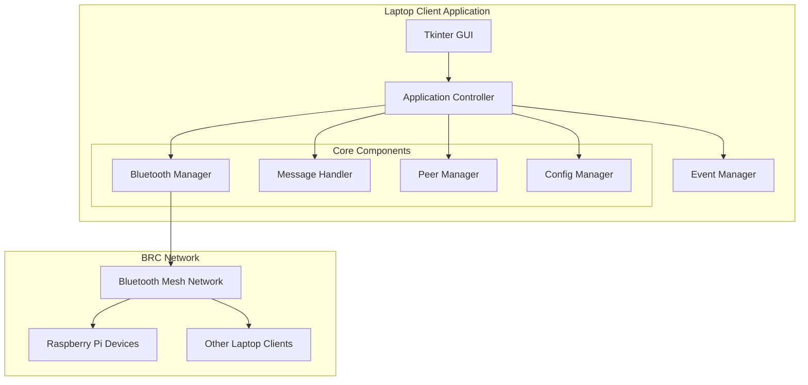
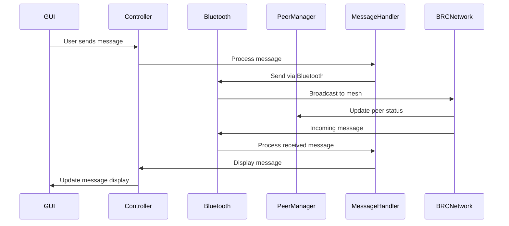

# Blue Relay Chat - Laptop Client Design

## Overview

This document outlines the design for a cross-platform laptop client for Blue Relay Chat (BRC) that provides a simple, minimal interface for communicating with devices in the BRC network using Bluetooth connectivity.

## Architecture

### High-Level Architecture



### Component Design

#### 1. Tkinter GUI Layer (`bitchat/gui/laptop_gui.py`)

**Purpose**: Provide a minimal, clean interface for chat functionality

**Key Features**:
- Compact window design (minimal footprint)
- Message display area with scrollable history
- Simple text input field
- Connection status indicator
- Peer list sidebar
- Channel selector

**Window Layout**:
```
┌─ Blue Relay Chat ─────────────────────────────────┐
│ Status: Connected (3 peers) | Channel: #bluetooth │
├─────────────────────────────────────────────────────┤
│ Peer List │ Message Display Area                  │
│ ├─ User1  │ ┌─────────────────────────────────────┐ │
│ ├─ User2  │ │ [12:34] User1: Hello there!       │ │
│ ├─ User3  │ │ [12:35] User2: Hi everyone!        │ │
│ └─ ...    │ │ [12:36] System: User4 joined       │ │
│           │ │                                     │ │
│           │ └─────────────────────────────────────┘ │
├─────────────────────────────────────────────────────┤
│ > [Message input field]              [Send] [Join] │
└─────────────────────────────────────────────────────┘
```

#### 2. Bluetooth Manager (`bitchat/transports/laptop_bluetooth.py`)

**Purpose**: Handle Bluetooth communication for laptop devices

**Key Features**:
- Cross-platform Bluetooth adapter detection
- Device discovery and scanning
- Connection management
- Message sending/receiving
- Integration with existing BRC mesh protocol

**Platform Considerations**:
- **Windows**: Windows Bluetooth APIs
- **macOS**: Core Bluetooth framework
- **Linux**: BlueZ via bleak library

#### 3. Application Controller (`bitchat/core/laptop_controller.py`)

**Purpose**: Coordinate all components and manage application lifecycle

**Key Features**:
- Initialize and manage all components
- Handle GUI events and user interactions
- Coordinate message flow between components
- Manage application state

#### 4. Message Handler (`bitchat/core/laptop_message_handler.py`)

**Purpose**: Process and manage messages

**Key Features**:
- Message parsing and validation
- Message history management
- Encryption/decryption coordination
- Message routing to appropriate transports

#### 5. Peer Manager (`bitchat/core/laptop_peer_manager.py`)

**Purpose**: Manage peer connections and discovery

**Key Features**:
- Peer discovery and tracking
- Connection status monitoring
- Peer information display
- Automatic reconnection

## Technical Specifications

### Dependencies

**Core Dependencies** (already in requirements.txt):
- `bleak>=0.20.0` - Cross-platform Bluetooth communication
- `cryptography>=41.0.0` - Encryption/decryption
- `aiofiles>=23.0.0` - Async file operations
- `aiosqlite>=0.19.0` - Database operations
- `lz4>=4.0.0` - Message compression

**GUI Dependencies**:
- `tkinter` - Built-in Python GUI framework
- `tkinter.scrolledtext` - For message history display
- `tkinter.ttk` - Modern themed widgets

### Configuration

**Laptop-Specific Configuration** (`config_laptop.ini`):
```ini
[laptop_gui]
window_width = 600
window_height = 400
min_window_width = 400
min_window_height = 300
auto_scroll = true
max_message_history = 1000
font_family = "TkDefaultFont"
font_size = 10

[bluetooth]
adapter_name = "auto"
scan_interval_seconds = 30
max_peers = 20
auto_reconnect = true
connection_timeout_seconds = 10

[messages]
timestamp_format = "%H:%M:%S"
show_system_messages = true
compact_display = false
sound_notifications = false

[performance]
gui_update_interval_ms = 100
message_queue_size = 500
max_concurrent_connections = 10
```

### Message Flow



## Implementation Plan

### Phase 1: Foundation (Week 1)
1. Create basic Tkinter GUI structure
2. Implement application controller
3. Set up configuration management
4. Create basic event system

### Phase 2: Bluetooth Integration (Week 2)
1. Implement cross-platform Bluetooth manager
2. Add device discovery functionality
3. Create connection management
4. Test basic communication

### Phase 3: Message Handling (Week 3)
1. Implement message processing
2. Add encryption/decryption
3. Create message history management
4. Add peer management

### Phase 4: Integration and Polish (Week 4)
1. Integrate all components
2. Add error handling and recovery
3. Optimize performance
4. Add user-friendly features

### Phase 5: Testing and Packaging (Week 5)
1. Test on all target platforms
2. Create installation packages
3. Write documentation
4. Final testing and bug fixes

## File Structure

```
bitchat/
├── gui/
│   ├── __init__.py
│   ├── small_screen_gui.py (existing)
│   ├── laptop_gui.py (new)
│   └── components/
│       ├── __init__.py
│       ├── message_display.py (new)
│       ├── peer_list.py (new)
│       └── input_panel.py (new)
├── core/
│   ├── __init__.py
│   ├── controller.py (existing)
│   ├── laptop_controller.py (new)
│   ├── laptop_message_handler.py (new)
│   └── laptop_peer_manager.py (new)
├── transports/
│   ├── __init__.py
│   ├── base.py (existing)
│   ├── mesh/
│   │   └── bluetooth.py (existing)
│   └── laptop_bluetooth.py (new)
├── config/
│   ├── __init__.py
│   ├── manager.py (existing)
│   └── defaults.py (update with laptop defaults)
└── scripts/
    ├── install_laptop_client.sh (new)
    └── package_laptop_client.py (new)
```

## Cross-Platform Considerations

### Windows
- Use Windows Bluetooth APIs via bleak
- Handle Windows-specific Bluetooth permissions
- Package with pyinstaller for standalone executable

### macOS
- Use Core Bluetooth framework via bleak
- Handle macOS Bluetooth permissions and entitlements
- Create .app bundle for distribution

### Linux
- Use BlueZ via bleak
- Handle different Linux distributions
- Package with AppImage or deb/rpm packages

## Security Considerations

1. **Bluetooth Security**:
   - Secure pairing with BRC devices
   - Encryption key exchange
   - Authentication verification

2. **Message Security**:
   - End-to-end encryption using existing BRC cryptography
   - Message integrity verification
   - Replay attack prevention

3. **Application Security**:
   - Secure configuration storage
   - Input validation and sanitization
   - Error handling without information leakage

## Performance Optimization

1. **GUI Performance**:
   - Efficient message display updates
   - Scrolling optimization
   - Memory management for message history

2. **Bluetooth Performance**:
   - Efficient device scanning
   - Connection pooling
   - Message batching

3. **Overall Performance**:
   - Async operations throughout
   - Resource monitoring
   - Adaptive performance based on system load

## User Experience

### Simplicity First
- Minimal interface with essential features only
- Intuitive controls and navigation
- Clear status indicators

### Accessibility
- Keyboard shortcuts for common operations
- High contrast mode support
- Screen reader compatibility

### Customization
- Configurable window size and position
- Adjustable font sizes
- Theme options (light/dark)

This design provides a solid foundation for implementing a cross-platform laptop client that integrates seamlessly with the existing Blue Relay Chat ecosystem while providing a simple, efficient user interface.