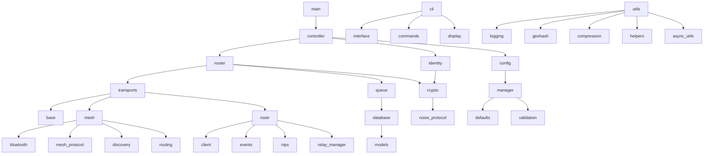

# Blue Relay Chat RPi 4 - Project Structure

## Directory Structure

```
blue-relay-chat-rpi4/
├── README.md                           # Project overview and setup instructions
├── LICENSE                             # MIT License
├── requirements.txt                    # Python dependencies
├── setup.py                           # Package installation configuration
├── config.ini                         # Default configuration file
├── architecture.md                    # System architecture documentation
├── project_structure.md               # This file
├── main.py                            # Application entry point
├── systemd/
│   ├── blue-relay-chat.service       # systemd service configuration
│   ├── blue-relay-chat-rpi-zero2w.service  # Raspberry Pi Zero 2 W service configuration
│   └── blue-relay-chat-user.service  # Per-user service configuration
├── scripts/
│   ├── install.sh                    # Installation script
│   ├── install_rpi_zero2w.sh        # Raspberry Pi Zero 2 W installation script
│   ├── install_orangepi.sh           # Orange Pi installation script
│   ├── uninstall.sh                  # Uninstallation script
│   └── emergency_wipe.sh             # Emergency data wipe script
├── tests/
│   ├── __init__.py
│   ├── conftest.py                   # pytest configuration
│   ├── unit/
│   │   ├── __init__.py
│   │   ├── test_config.py
│   │   ├── test_identity.py
│   │   ├── test_crypto.py
│   │   ├── test_router.py
│   │   ├── test_transports.py
│   │   └── test_cli.py
│   ├── integration/
│   │   ├── __init__.py
│   │   ├── test_mesh_transport.py
│   │   ├── test_nostr_transport.py
│   │   └── test_end_to_end.py
│   └── fixtures/
│       ├── test_config.ini
│       └── test_db.sqlite
├── docs/
│   ├── user_guide.md
│   ├── api_reference.md
│   ├── deployment_guide.md
│   └── troubleshooting.md
└── blue_relay_chat/
    ├── __init__.py
    ├── version.py                     # Version information
    ├── exceptions.py                  # Custom exception classes
    ├── constants.py                   # Application constants
    ├── main.py                        # Main application controller
    ├── cli/
    │   ├── __init__.py
    │   ├── interface.py               # Main CLI interface
    │   ├── commands.py                # Command parsing and execution
    │   ├── display.py                 # Screen rendering and formatting
    │   └── widgets.py                 # Reusable UI components
    ├── core/
    │   ├── __init__.py
    │   ├── controller.py              # Core application controller
    │   ├── router.py                  # Message routing logic
    │   └── events.py                  # Event system and handlers
    ├── transports/
    │   ├── __init__.py
    │   ├── base.py                    # Abstract transport interface
    │   ├── mesh/
    │   │   ├── __init__.py
    │   │   ├── bluetooth.py           # Bluetooth LE implementation
    │   │   ├── mesh_protocol.py       # Mesh networking protocol
    │   │   ├── discovery.py           # Peer discovery
    │   │   └── routing.py             # Message routing in mesh
    │   └── nostr/
    │       ├── __init__.py
    │       ├── client.py              # Nostr client implementation
    │       ├── events.py              # Nostr event handling
    │       ├── nips/
    │       │   ├── __init__.py
    │       │   ├── nip01.py           # Basic protocol
    │       │   ├── nip04.py           # Encryption
    │       │   └── nip17.py           # Gift wraps
    │       └── relay_manager.py       # Relay connection management
    ├── security/
    │   ├── __init__.py
    │   ├── identity.py                # Identity and key management
    │   ├── crypto.py                  # Cryptographic operations
    │   ├── noise_protocol.py          # Noise Protocol implementation
    │   └── emergency_wipe.py          # Emergency data wipe
    ├── data/
    │   ├── __init__.py
    │   ├── database.py                # Database operations
    │   ├── models.py                  # Data models
    │   ├── migrations.py              # Database schema migrations
    │   └── queue.py                   # Message queue implementation
    ├── config/
    │   ├── __init__.py
    │   ├── manager.py                 # Configuration management
    │   ├── defaults.py                # Default settings
    │   └── validation.py              # Configuration validation
    └── utils/
        ├── __init__.py
        ├── logging.py                 # Logging utilities
        ├── geohash.py                 # Geohash utilities
        ├── compression.py             # LZ4 compression
        ├── helpers.py                 # General helper functions
        └── async_utils.py             # Async programming utilities
```

## Key Files Overview

### Core Application Files

- **main.py**: Application entry point that initializes and starts the system
- **bitchat/main.py**: Core application controller that coordinates all components
- **bitchat/core/controller.py**: Main application logic and state management
- **bitchat/core/router.py**: Message routing between transports

### Transport Layer

- **bitchat/transports/base.py**: Abstract interface for all transports
- **bitchat/transports/mesh/**: Bluetooth LE Mesh implementation
- **bitchat/transports/nostr/**: Nostr protocol implementation

### Security and Identity

- **bitchat/security/identity.py**: Key generation and management
- **bitchat/security/crypto.py**: Encryption/decryption operations
- **bitchat/security/noise_protocol.py**: Noise Protocol for mesh encryption

### Data Management

- **bitchat/data/database.py**: SQLite database operations
- **bitchat/data/models.py**: Data model definitions
- **bitchat/data/queue.py**: Message queue implementation

### User Interface

- **bitchat/cli/interface.py**: Main CLI interface using curses
- **bitchat/cli/commands.py**: Command parsing and execution
- **bitchat/cli/display.py**: Screen rendering and formatting

### Configuration

- **bitchat/config/manager.py**: Configuration file management
- **config.ini**: Default configuration settings

### Deployment

- **systemd/blue-relay-chat.service**: systemd service for system-wide installation
- **systemd/blue-relay-chat-rpi-zero2w.service**: systemd service optimized for Raspberry Pi Zero 2 W
- **scripts/install.sh**: General installation automation script
- **scripts/install_rpi_zero2w.sh**: Raspberry Pi Zero 2 W specific installation script
- **scripts/install_orangepi.sh**: Orange Pi specific installation script
- **config_rpi_zero2w.ini**: Raspberry Pi Zero 2 W optimized configuration
- **requirements.txt**: Python package dependencies

## Module Dependencies



## Implementation Phases

### Phase 1: Foundation (Week 1-2)
1. Project structure setup
2. Configuration management
3. Database schema and models
4. Basic CLI interface
5. Logging and utilities

### Phase 2: Core Logic (Week 3-4)
1. Identity management
2. Cryptography services
3. Message router framework
4. Transport base classes
5. Message queuing

### Phase 3: Transport Implementation (Week 5-6)
1. Bluetooth LE Mesh transport
2. Nostr protocol transport
3. Transport integration
4. Message routing logic
5. Error handling and recovery

### Phase 4: Features and Polish (Week 7-8)
1. Channel management
2. Location-based features
3. Emergency wipe
4. Performance optimization
5. Comprehensive testing

### Phase 5: Deployment (Week 9-10)
1. Packaging and installation
2. systemd service configuration
3. Hardware-specific optimizations
4. Multi-platform support implementation
5. Documentation completion
6. Final testing and validation
7. Release preparation

## Development Guidelines

### Code Style
- Follow PEP 8 Python style guidelines
- Use type hints for all function signatures
- Document all public functions and classes
- Keep modules focused and cohesive

### Testing
- Write unit tests for all core functionality
- Use pytest for test framework
- Mock external dependencies in unit tests
- Include integration tests for transport layers

### Security
- Validate all inputs and outputs
- Use secure coding practices
- Implement proper error handling without information leakage
- Regular security reviews of cryptographic code

### Performance
- Use async/await for I/O operations
- Profile and optimize critical paths
- Monitor resource usage
- Implement appropriate caching strategies