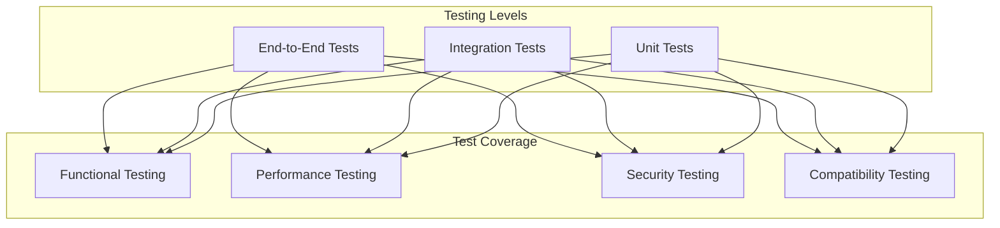

# Cross-Platform Testing Plan for Laptop Client

## Overview

This document outlines the comprehensive testing strategy for the Blue Relay Chat laptop client across Windows, macOS, and Linux platforms.

## Testing Strategy

### Testing Pyramid



## Unit Testing

### Test Structure

#### GUI Components Tests (`tests/unit/test_gui_components.py`)
```python
import unittest
import tkinter as tk
from unittest.mock import Mock, patch
import sys
import os

# Add project root to path
sys.path.insert(0, os.path.join(os.path.dirname(__file__), '..', '..'))

from bitchat.gui.components.message_display import MessageDisplay
from bitchat.gui.components.peer_list import PeerList
from bitchat.gui.components.input_panel import InputPanel
from bitchat.config.manager import ConfigManager

class TestMessageDisplay(unittest.TestCase):
    """Test message display component."""
    
    def setUp(self):
        self.root = tk.Tk()
        self.config = ConfigManager()
        self.display = MessageDisplay(self.root, self.config)
    
    def tearDown(self):
        self.root.destroy()
    
    def test_add_message(self):
        """Test adding messages to display."""
        message = {
            "sender": "test_user",
            "content": "Hello, world!",
            "type": "received",
            "timestamp": "12:34:56"
        }
        
        self.display.add_message(message)
        
        # Verify message was added
        self.assertIn("test_user", self.display.display.get(1.0, tk.END))
        self.assertIn("Hello, world!", self.display.display.get(1.0, tk.END))
    
    def test_message_formatting(self):
        """Test message formatting."""
        test_cases = [
            {"type": "sent", "expected_tag": "sent"},
            {"type": "received", "expected_tag": "received"},
            {"type": "system", "expected_tag": "system"},
            {"type": "error", "expected_tag": "error"}
        ]
        
        for case in test_cases:
            with self.subTest(case=case):
                message = {
                    "sender": "test_user",
                    "content": "Test message",
                    "type": case["type"]
                }
                
                self.display.add_message(message)
                
                # Verify correct tag was applied
                # (This would require access to internal tag configuration)
    
    def test_clear_messages(self):
        """Test clearing all messages."""
        # Add some messages
        for i in range(5):
            self.display.add_message({
                "sender": f"user_{i}",
                "content": f"Message {i}",
                "type": "received"
            })
        
        # Clear messages
        self.display.clear()
        
        # Verify display is empty
        content = self.display.display.get(1.0, tk.END)
        self.assertEqual(content.strip(), "")

class TestPeerList(unittest.TestCase):
    """Test peer list component."""
    
    def setUp(self):
        self.root = tk.Tk()
        self.config = ConfigManager()
        self.peer_list = PeerList(self.root, self.config)
    
    def tearDown(self):
        self.root.destroy()
    
    def test_add_peer(self):
        """Test adding a peer to the list."""
        peer_info = {
            "name": "Test User",
            "status": "online",
            "address": "00:11:22:33:44:55"
        }
        
        self.peer_list.update_peer("test_peer_id", peer_info)
        
        # Verify peer was added
        self.assertEqual(self.peer_list.listbox.size(), 1)
        self.assertIn("Test User", self.peer_list.listbox.get(0))
    
    def test_peer_status_indicators(self):
        """Test peer status indicators."""
        test_cases = [
            {"status": "online", "indicator": "●"},
            {"status": "connecting", "indicator": "◐"},
            {"status": "offline", "indicator": "○"}
        ]
        
        for case in test_cases:
            with self.subTest(case=case):
                peer_info = {
                    "name": "Test User",
                    "status": case["status"]
                }
                
                self.peer_list.update_peer("test_peer_id", peer_info)
                
                # Verify correct indicator
                display_text = self.peer_list.listbox.get(0)
                self.assertTrue(display_text.startswith(case["indicator"]))
    
    def test_remove_peer(self):
        """Test removing a peer from the list."""
        # Add a peer first
        self.peer_list.update_peer("test_peer_id", {
            "name": "Test User",
            "status": "online"
        })
        
        # Remove the peer
        self.peer_list.remove_peer("test_peer_id")
        
        # Verify peer was removed
        self.assertEqual(self.peer_list.listbox.size(), 0)

class TestInputPanel(unittest.TestCase):
    """Test input panel component."""
    
    def setUp(self):
        self.root = tk.Tk()
        self.config = ConfigManager()
        self.send_callback = Mock()
        self.input_panel = InputPanel(self.root, self.config, self.send_callback)
    
    def tearDown(self):
        self.root.destroy()
    
    def test_send_message(self):
        """Test sending a message."""
        # Set input text
        self.input_panel.input_field.insert(0, "Test message")
        
        # Trigger send
        self.input_panel.on_send()
        
        # Verify callback was called
        self.send_callback.assert_called_once_with("Test message")
        
        # Verify input was cleared
        self.assertEqual(self.input_panel.get_text(), "")
    
    def test_send_empty_message(self):
        """Test sending empty message."""
        # Trigger send with empty input
        self.input_panel.on_send()
        
        # Verify callback was not called
        self.send_callback.assert_not_called()
```

#### Bluetooth Transport Tests (`tests/unit/test_laptop_bluetooth.py`)
```python
import unittest
import asyncio
from unittest.mock import Mock, AsyncMock, patch
import sys
import os

# Add project root to path
sys.path.insert(0, os.path.join(os.path.dirname(__file__), '..', '..'))

from bitchat.transports.laptop_bluetooth import LaptopBluetoothTransport
from bitchat.config.manager import ConfigManager

class TestLaptopBluetoothTransport(unittest.TestCase):
    """Test laptop Bluetooth transport."""
    
    def setUp(self):
        self.config = ConfigManager()
        self.transport = LaptopBluetoothTransport(self.config)
    
    def test_platform_detection(self):
        """Test platform detection."""
        with patch('platform.system', return_value='Windows'):
            transport = LaptopBluetoothTransport(self.config)
            self.assertEqual(transport.platform, 'windows')
        
        with patch('platform.system', return_value='Darwin'):
            transport = LaptopBluetoothTransport(self.config)
            self.assertEqual(transport.platform, 'darwin')
        
        with patch('platform.system', return_value='Linux'):
            transport = LaptopBluetoothTransport(self.config)
            self.assertEqual(transport.platform, 'linux')
    
    def test_adapter_selection(self):
        """Test Bluetooth adapter selection."""
        test_cases = [
            {"config": "auto", "expected": None},
            {"config": "hci0", "expected": "hci0"},
            {"config": "Bluetooth Adapter", "expected": "Bluetooth Adapter"}
        ]
        
        for case in test_cases:
            with self.subTest(case=case):
                self.config.set("bluetooth.adapter_name", case["config"])
                transport = LaptopBluetoothTransport(self.config)
                
                if transport.platform == "linux":
                    result = transport._get_linux_adapter()
                    self.assertEqual(result, case["expected"])
    
    @patch('subprocess.run')
    def test_windows_bluetooth_check(self, mock_run):
        """Test Windows Bluetooth availability check."""
        # Mock successful check
        mock_run.return_value.returncode = 0
        
        result = asyncio.run(self.transport._check_windows_bluetooth())
        
        self.assertTrue(result)
        mock_run.assert_called_once()
    
    @patch('subprocess.run')
    def test_linux_bluetooth_check(self, mock_run):
        """Test Linux Bluetooth availability check."""
        # Mock successful check
        mock_run.return_value.returncode = 0
        mock_run.return_value.stdout = "hci0:	Type:	Bus"
        
        result = asyncio.run(self.transport._check_linux_bluetooth())
        
        self.assertTrue(result)
        mock_run.assert_called_once_with(["hciconfig"], capture_output=True, text=True)
```

#### Configuration Tests (`tests/unit/test_laptop_config.py`)
```python
import unittest
import tempfile
import os
import sys

# Add project root to path
sys.path.insert(0, os.path.join(os.path.dirname(__file__), '..', '..'))

from bitchat.config.manager import ConfigManager

class TestLaptopConfiguration(unittest.TestCase):
    """Test laptop-specific configuration."""
    
    def setUp(self):
        # Create temporary config file
        self.temp_dir = tempfile.mkdtemp()
        self.config_file = os.path.join(self.temp_dir, "test_config.ini")
        
        # Write test configuration
        with open(self.config_file, 'w') as f:
            f.write("""
[laptop_gui]
window_width = 800
window_height = 600
font_size = 12

[laptop_bluetooth]
max_peers = 15
scan_interval_seconds = 45
""")
        
        self.config = ConfigManager(self.config_file)
    
    def tearDown(self):
        import shutil
        shutil.rmtree(self.temp_dir)
    
    def test_laptop_gui_config(self):
        """Test laptop GUI configuration loading."""
        gui_config = self.config.get_laptop_gui_config()
        
        self.assertEqual(gui_config.get("window_width"), 800)
        self.assertEqual(gui_config.get("window_height"), 600)
        self.assertEqual(gui_config.get("font_size"), 12)
    
    def test_laptop_bluetooth_config(self):
        """Test laptop Bluetooth configuration loading."""
        bt_config = self.config.get_laptop_bluetooth_config()
        
        self.assertEqual(bt_config.get("max_peers"), 15)
        self.assertEqual(bt_config.get("scan_interval_seconds"), 45)
    
    def test_default_fallback(self):
        """Test default value fallback."""
        # Remove config file
        os.remove(self.config_file)
        
        config = ConfigManager(self.config_file)
        gui_config = config.get_laptop_gui_config()
        
        # Should use defaults
        self.assertEqual(gui_config.get("window_width"), 600)
        self.assertEqual(gui_config.get("window_height"), 400)
```

## Integration Testing

### Test Environment Setup

#### Docker Test Environment (`tests/docker/docker-compose.yml`)
```yaml
version: '3.8'

services:
  laptop-client:
    build:
      context: ../../
      dockerfile: tests/docker/Dockerfile.laptop
    volumes:
      - ../../:/app
    environment:
      - DISPLAY=:99
      - BITCHAT_TEST_MODE=true
    depends_on:
      - bluetooth-simulator
      - test-relay
  
  bluetooth-simulator:
    build:
      context: .
      dockerfile: Dockerfile.bluetooth-simulator
    ports:
      - "8080:8080"
  
  test-relay:
    image: nostr-relay:latest
    ports:
      - "8081:8080"
```

#### Bluetooth Simulator (`tests/docker/Dockerfile.bluetooth-simulator`)
```dockerfile
FROM python:3.9-slim

WORKDIR /app

COPY requirements.txt .
RUN pip install -r requirements.txt

COPY tests/bluetooth_simulator.py .

CMD ["python", "bluetooth_simulator.py"]
```

### Integration Tests (`tests/integration/test_bluetooth_integration.py`)
```python
import unittest
import asyncio
import tempfile
import sys
import os

# Add project root to path
sys.path.insert(0, os.path.join(os.path.dirname(__file__), '..', '..'))

from bitchat.transports.laptop_bluetooth import LaptopBluetoothTransport
from bitchat.config.manager import ConfigManager
from tests.mocks.bluetooth_mock import MockBluetoothAdapter

class TestBluetoothIntegration(unittest.TestCase):
    """Integration tests for Bluetooth functionality."""
    
    def setUp(self):
        self.config = ConfigManager()
        self.config.set("bluetooth.adapter_name", "mock_adapter")
        
        # Use mock adapter for testing
        self.mock_adapter = MockBluetoothAdapter()
    
    async def test_device_discovery(self):
        """Test device discovery process."""
        transport = LaptopBluetoothTransport(self.config)
        
        # Mock device discovery
        self.mock_adapter.add_mock_device("TestDevice1", "00:11:22:33:44:55")
        self.mock_adapter.add_mock_device("TestDevice2", "00:11:22:33:44:66")
        
        # Start transport
        await transport.start()
        
        # Wait for discovery
        await asyncio.sleep(2)
        
        # Verify devices were discovered
        self.assertGreater(len(transport._device_info), 0)
        
        # Stop transport
        await transport.stop()
    
    async def test_message_exchange(self):
        """Test message exchange between devices."""
        # Create two transports
        transport1 = LaptopBluetoothTransport(self.config)
        transport2 = LaptopBluetoothTransport(self.config)
        
        # Start both transports
        await transport1.start()
        await transport2.start()
        
        # Connect devices
        # (This would require mock connection setup)
        
        # Send message from transport1 to transport2
        message = {
            "content": "Hello from transport1",
            "type": "text",
            "sender": "transport1"
        }
        
        result = await transport1.send_message(message)
        self.assertTrue(result)
        
        # Wait for message delivery
        await asyncio.sleep(1)
        
        # Verify message was received
        # (This would require message capture mechanism)
        
        # Stop transports
        await transport1.stop()
        await transport2.stop()
```

## End-to-End Testing

### Test Scenarios

#### 1. Basic Chat Flow (`tests/e2e/test_basic_chat.py`)
```python
import unittest
import asyncio
import sys
import os

# Add project root to path
sys.path.insert(0, os.path.join(os.path.dirname(__file__), '..', '..'))

from main_laptop import LaptopClientApp
from tests.utils.test_helpers import TestEnvironment

class TestBasicChat(unittest.TestCase):
    """Test basic chat functionality end-to-end."""
    
    def setUp(self):
        self.test_env = TestEnvironment()
        self.app = LaptopClientApp()
    
    async def test_send_receive_message(self):
        """Test sending and receiving a message."""
        # Initialize app
        await self.app.initialize()
        
        # Start app in background
        app_task = asyncio.create_task(self.app.start())
        
        try:
            # Wait for GUI to be ready
            await asyncio.sleep(1)
            
            # Send a message
            test_message = "Hello, world!"
            self.app.gui.input_field.insert(0, test_message)
            self.app.gui.send_message()
            
            # Verify message appears in display
            await asyncio.sleep(0.5)
            
            display_content = self.app.gui.message_display.get(1.0, "end")
            self.assertIn(test_message, display_content)
            
        finally:
            # Stop app
            await self.app.stop()
            app_task.cancel()
    
    async def test_peer_connection(self):
        """Test peer connection and disconnection."""
        # Initialize app
        await self.app.initialize()
        
        # Start app in background
        app_task = asyncio.create_task(self.app.start())
        
        try:
            # Wait for GUI to be ready
            await asyncio.sleep(1)
            
            # Simulate peer connection
            self.test_env.simulate_peer_connection("TestPeer", "00:11:22:33:44:55")
            
            # Wait for GUI update
            await asyncio.sleep(0.5)
            
            # Verify peer appears in peer list
            peer_list = self.app.gui.peer_list
            self.assertGreater(peer_list.listbox.size(), 0)
            
            # Simulate peer disconnection
            self.test_env.simulate_peer_disconnection("TestPeer")
            
            # Wait for GUI update
            await asyncio.sleep(0.5)
            
            # Verify peer is removed from list
            # (This would require checking the peer list content)
            
        finally:
            # Stop app
            await self.app.stop()
            app_task.cancel()
```

#### 2. Multi-Platform Compatibility (`tests/e2e/test_platform_compatibility.py`)
```python
import unittest
import platform
import subprocess
import tempfile
import os

class TestPlatformCompatibility(unittest.TestCase):
    """Test platform-specific functionality."""
    
    def test_bluetooth_adapter_detection(self):
        """Test Bluetooth adapter detection on current platform."""
        current_platform = platform.system().lower()
        
        if current_platform == "windows":
            # Test Windows Bluetooth detection
            result = subprocess.run(
                ["powershell", "Get-BluetoothDevice"],
                capture_output=True,
                text=True
            )
            # Should not crash and should return some output
            self.assertIsNotNone(result)
            
        elif current_platform == "darwin":
            # Test macOS Bluetooth detection
            result = subprocess.run(
                ["system_profiler", "SPBluetoothDataType"],
                capture_output=True,
                text=True
            )
            # Should not crash and should return some output
            self.assertIsNotNone(result)
            
        elif current_platform == "linux":
            # Test Linux Bluetooth detection
            result = subprocess.run(
                ["hciconfig"],
                capture_output=True,
                text=True
            )
            # Should not crash and should return some output
            self.assertIsNotNone(result)
    
    def test_gui_rendering(self):
        """Test GUI rendering on current platform."""
        try:
            import tkinter as tk
            
            # Create a test window
            root = tk.Tk()
            root.withdraw()  # Hide the window
            
            # Test basic GUI components
            from bitchat.gui.components.message_display import MessageDisplay
            from bitchat.gui.components.peer_list import PeerList
            from bitchat.gui.components.input_panel import InputPanel
            
            # Create components
            display = MessageDisplay(root, None)
            peer_list = PeerList(root, None)
            input_panel = InputPanel(root, None)
            
            # If we get here without exceptions, GUI rendering works
            self.assertTrue(True)
            
            # Cleanup
            root.destroy()
            
        except Exception as e:
            self.fail(f"GUI rendering failed on {platform.system()}: {e}")
```

## Performance Testing

### Test Metrics

#### GUI Performance (`tests/performance/test_gui_performance.py`)
```python
import unittest
import time
import asyncio
import sys
import os

# Add project root to path
sys.path.insert(0, os.path.join(os.path.dirname(__file__), '..', '..'))

from bitchat.gui.laptop_gui import LaptopGUI
from bitchat.config.manager import ConfigManager

class TestGUIPerformance(unittest.TestCase):
    """Test GUI performance characteristics."""
    
    def setUp(self):
        self.config = ConfigManager()
        self.event_loop = asyncio.new_event_loop()
        asyncio.set_event_loop(self.event_loop)
    
    def tearDown(self):
        self.event_loop.close()
    
    def test_message_display_performance(self):
        """Test message display performance with many messages."""
        # Create GUI
        gui = LaptopGUI(self.config, None)
        
        # Measure time to add 1000 messages
        start_time = time.time()
        
        for i in range(1000):
            message = {
                "sender": f"user_{i % 10}",
                "content": f"Test message {i}",
                "type": "received" if i % 2 == 0 else "sent"
            }
            gui.add_message(message)
        
        end_time = time.time()
        elapsed_time = end_time - start_time
        
        # Should complete within reasonable time (5 seconds)
        self.assertLess(elapsed_time, 5.0)
        
        # Memory usage should be reasonable
        # (This would require memory profiling)
    
    def test_gui_responsiveness(self):
        """Test GUI responsiveness under load."""
        # Create GUI
        gui = LaptopGUI(self.config, None)
        
        # Simulate rapid message additions
        def add_messages():
            for i in range(100):
                message = {
                    "sender": "test_user",
                    "content": f"Rapid message {i}",
                    "type": "received"
                }
                gui.add_message(message)
                time.sleep(0.01)  # 10ms between messages
        
        # Run in thread to avoid blocking
        import threading
        thread = threading.Thread(target=add_messages)
        thread.start()
        
        # Measure GUI responsiveness
        start_time = time.time()
        thread.join()
        end_time = time.time()
        
        # GUI should remain responsive
        self.assertLess(end_time - start_time, 2.0)
```

## Security Testing

### Test Cases

#### 1. Input Validation (`tests/security/test_input_validation.py`)
```python
import unittest
import sys
import os

# Add project root to path
sys.path.insert(0, os.path.join(os.path.dirname(__file__), '..', '..'))

from bitchat.gui.laptop_gui import LaptopGUI
from bitchat.config.manager import ConfigManager

class TestInputValidation(unittest.TestCase):
    """Test input validation and security."""
    
    def setUp(self):
        self.config = ConfigManager()
        self.gui = LaptopGUI(self.config, None)
    
    def test_message_length_validation(self):
        """Test message length validation."""
        # Test very long message
        long_message = "A" * 10000
        
        # Should handle gracefully without crashing
        try:
            self.gui.send_message(long_message)
            # If we get here, no crash occurred
            self.assertTrue(True)
        except Exception as e:
            self.fail(f"Long message caused crash: {e}")
    
    def test_special_characters(self):
        """Test handling of special characters."""
        special_chars = [
            "Message with \n newlines",
            "Message with \t tabs",
            "Message with \0 null bytes",
            "Message with unicode: 🚀 🔒",
            "Message with quotes: 'single' and \"double\"",
            "Message with backslashes: \\"
        ]
        
        for char_string in special_chars:
            with self.subTest(char_string=char_string):
                try:
                    self.gui.send_message(char_string)
                    # Should handle without crashing
                    self.assertTrue(True)
                except Exception as e:
                    self.fail(f"Special characters caused crash: {e}")
    
    def test_malformed_input(self):
        """Test handling of malformed input."""
        malformed_inputs = [
            None,
            "",
            "   ",  # Only whitespace
            "\x00\x01\x02",  # Control characters
        ]
        
        for malformed_input in malformed_inputs:
            with self.subTest(input=malformed_input):
                try:
                    self.gui.send_message(malformed_input)
                    # Should handle gracefully
                    self.assertTrue(True)
                except Exception as e:
                    self.fail(f"Malformed input caused crash: {e}")
```

## Test Automation

### Continuous Integration

#### GitHub Actions Workflow (`.github/workflows/test.yml`)
```yaml
name: Test Suite

on:
  push:
    branches: [ main ]
  pull_request:
    branches: [ main ]

jobs:
  test:
    strategy:
      matrix:
        os: [ubuntu-latest, windows-latest, macos-latest]
        python-version: [3.8, 3.9, '3.10']
    
    runs-on: ${{ matrix.os }}
    
    steps:
    - uses: actions/checkout@v3
    
    - name: Set up Python ${{ matrix.python-version }}
      uses: actions/setup-python@v4
      with:
        python-version: ${{ matrix.python-version }}
    
    - name: Install dependencies
      run: |
        python -m pip install --upgrade pip
        pip install -r requirements.txt
        pip install pytest pytest-asyncio pytest-cov pytest-mock
    
    - name: Run unit tests
      run: |
        pytest tests/unit/ -v --cov=bitchat --cov-report=xml
    
    - name: Run integration tests
      run: |
        pytest tests/integration/ -v
    
    - name: Run end-to-end tests
      run: |
        pytest tests/e2e/ -v
    
    - name: Upload coverage to Codecov
      uses: codecov/codecov-action@v3
      with:
        file: ./coverage.xml
        flags: unittests
        name: codecov-umbrella
```

### Local Testing

#### Test Runner (`scripts/run_tests.py`)
```python
#!/usr/bin/env python3
"""
Comprehensive test runner for laptop client.
"""

import subprocess
import sys
import argparse
import os

class TestRunner:
    """Comprehensive test runner."""
    
    def __init__(self):
        self.project_root = os.path.dirname(os.path.dirname(os.path.abspath(__file__)))
        self.test_results = {}
    
    def run_unit_tests(self):
        """Run unit tests."""
        print("Running unit tests...")
        
        cmd = [
            sys.executable, "-m", "pytest",
            "tests/unit/",
            "-v",
            "--cov=bitchat",
            "--cov-report=term-missing",
            "--cov-report=html",
            "--cov-report=xml"
        ]
        
        result = subprocess.run(cmd, cwd=self.project_root)
        self.test_results["unit"] = result.returncode == 0
        
        return result.returncode == 0
    
    def run_integration_tests(self):
        """Run integration tests."""
        print("Running integration tests...")
        
        cmd = [
            sys.executable, "-m", "pytest",
            "tests/integration/",
            "-v"
        ]
        
        result = subprocess.run(cmd, cwd=self.project_root)
        self.test_results["integration"] = result.returncode == 0
        
        return result.returncode == 0
    
    def run_e2e_tests(self):
        """Run end-to-end tests."""
        print("Running end-to-end tests...")
        
        cmd = [
            sys.executable, "-m", "pytest",
            "tests/e2e/",
            "-v"
        ]
        
        result = subprocess.run(cmd, cwd=self.project_root)
        self.test_results["e2e"] = result.returncode == 0
        
        return result.returncode == 0
    
    def run_performance_tests(self):
        """Run performance tests."""
        print("Running performance tests...")
        
        cmd = [
            sys.executable, "-m", "pytest",
            "tests/performance/",
            "-v"
        ]
        
        result = subprocess.run(cmd, cwd=self.project_root)
        self.test_results["performance"] = result.returncode == 0
        
        return result.returncode == 0
    
    def run_security_tests(self):
        """Run security tests."""
        print("Running security tests...")
        
        cmd = [
            sys.executable, "-m", "pytest",
            "tests/security/",
            "-v"
        ]
        
        result = subprocess.run(cmd, cwd=self.project_root)
        self.test_results["security"] = result.returncode == 0
        
        return result.returncode == 0
    
    def run_all_tests(self):
        """Run all test suites."""
        test_suites = [
            ("unit", self.run_unit_tests),
            ("integration", self.run_integration_tests),
            ("e2e", self.run_e2e_tests),
            ("performance", self.run_performance_tests),
            ("security", self.run_security_tests)
        ]
        
        all_passed = True
        
        for suite_name, suite_func in test_suites:
            try:
                passed = suite_func()
                if not passed:
                    all_passed = False
                    print(f"❌ {suite_name.title()} tests failed")
                else:
                    print(f"✅ {suite_name.title()} tests passed")
            except Exception as e:
                all_passed = False
                print(f"❌ {suite_name.title()} tests crashed: {e}")
        
        # Print summary
        print("\n" + "="*50)
        print("TEST SUMMARY")
        print("="*50)
        
        for suite_name, passed in self.test_results.items():
            status = "✅ PASSED" if passed else "❌ FAILED"
            print(f"{suite_name.upper():<15} {status}")
        
        return all_passed
    
    def run_specific_suite(self, suite_name):
        """Run a specific test suite."""
        suite_methods = {
            "unit": self.run_unit_tests,
            "integration": self.run_integration_tests,
            "e2e": self.run_e2e_tests,
            "performance": self.run_performance_tests,
            "security": self.run_security_tests
        }
        
        if suite_name not in suite_methods:
            print(f"Unknown test suite: {suite_name}")
            print(f"Available suites: {', '.join(suite_methods.keys())}")
            return False
        
        return suite_methods[suite_name]()

def main():
    parser = argparse.ArgumentParser(description="Run Blue Relay Chat laptop client tests")
    parser.add_argument("suite", nargs="?", choices=["unit", "integration", "e2e", "performance", "security", "all"],
                       help="Test suite to run (default: all)", default="all")
    
    args = parser.parse_args()
    
    runner = TestRunner()
    
    if args.suite == "all":
        success = runner.run_all_tests()
    else:
        success = runner.run_specific_suite(args.suite)
    
    sys.exit(0 if success else 1)

if __name__ == "__main__":
    main()
```

This comprehensive testing plan ensures that the Blue Relay Chat laptop client is thoroughly tested across all platforms, covering functionality, performance, security, and compatibility aspects.